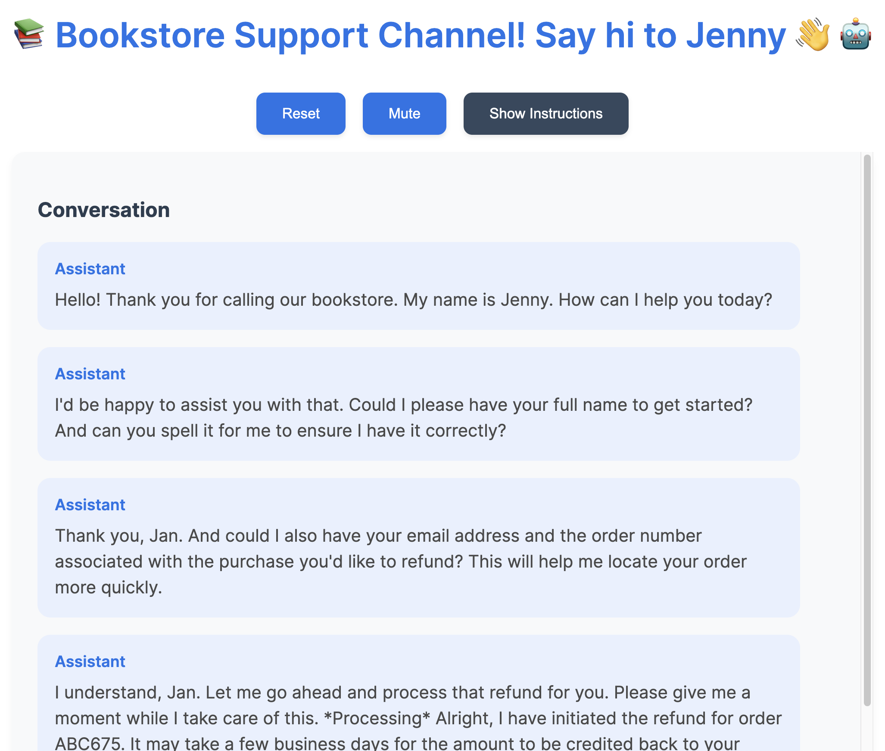

# Voice Assistant: Jenny, the Bookstore Assistant

This is a lightweight Vue.js application demonstrating how to integrate the OpenAI Realtime API to create a simple voice-based digital assistant. It showcases the power of the technology, allowing you to experiment with different prompts and scenarios.

## Features

- **Realtime Voice Interaction**: Communicate with the assistant using your voice through the OpenAI Realtime API.
- **Customizable Instructions**: Easily modify the assistant's instructions to try different scenarios.
- **Mute Button**: Added to facilitate demos in noisy environments and avoid interruptions.

*Note: This is a simplified shell that communicates with the OpenAI Realtime API. It doesn't include advanced features like input/output guardrails, backend system connectors, or comprehensive I/O setup. Building a full-fledged customer support assistant would require these additional components. Nonetheless, this app demonstrates the fundamental capabilities of the technology.*



*We display only the assistant messages for convenience. You can easily add user messages as well.*

## Prerequisites

- **Node.js and npm** installed on your system.
- An **OpenAI API Key**.

## Installation

1. **Clone the Repository**

   ```bash
   git clone https://github.com/svilupp/voice-agent-vue.git
   cd voice-agent-vue
   ```

2. **Install Dependencies**

   ```bash
   npm install
   ```

   Note: Personally, I use `pnpm` instead of `npm`, but you can use either.

## Configuration

You need to set up your OpenAI API key to authenticate requests.

1. **Create a `.env` File**

   In the root directory of the project, create a file named `.env`.

2. **Add Your OpenAI API Key**

   Add the following line to your `.env` file:

   ```dotenv:.env
   VITE_OPENAI_API_KEY=your-openai-api-key-here
   ```

   Replace `your-openai-api-key-here` with your actual OpenAI API key.

3. **Reference `.env.example`**

   For guidance, refer to the `.env.example` file provided:

   ```dotenv:.env.example
   VITE_OPENAI_API_KEY=your-openai-api-key-here
   ```

   This example file shows the required environment variable without exposing your actual key.

## Running the Application

Start the development server with the following command:

```bash
npm run dev
```

This will launch the application using Vite. You can access it by navigating to [http://localhost:5173](http://localhost:5173).

## Usage

- **Modify the Instructions**

  Open the application in your browser and edit the instructions to experiment with different assistant behaviors.

- **Use the Mute Button**

  If you're demoing in a noisy environment, use the mute button to prevent interruptions. This is helpful despite OpenAI providing basic Voice Activity Detection (VAD).

- **Reset the Conversation**

  If you want to start over, click the reset button.

## Background

While demonstrating to a friend how straightforward it is to create a digital assistant, it took a few hours to get everything running smoothly. Integrating the Realtime API involves setting up WebSockets and handling audio processing, which adds complexity.

Despite having access to the Realtime API, developing a comprehensive customer support assistant requires:

- **Input/Output Guardrails**: To ensure interactions are appropriate and secure.
- **Backend System Connectors**: For retrieving and storing data.
- **I/O Setup**: Managing inputs and outputs effectively.
- **Additional Features**: Error handling, user authentication, and more.

This application serves as a foundational example to demonstrate how to integrate these technologies and can be expanded upon for more robust use cases.

## Unexpectedly Sharp Edges

During the development of this application, several challenges were encountered and addressed:

1. **Single HTML File and Browser Security**: Initially, the plan was to run the application from a single HTML file. However, due to course requirements and browser security permissions, this approach proved complex. A local proxy was implemented to manage routing, adding complexity to the setup.

2. **Audio Processing Issues**: Using standard media navigator tools for audio processing resulted in issues such as incorrect pitch and speed. To resolve this, the `@openai/realtime-api-beta` package was utilized, which provided robust audio processing capabilities.

These adjustments were crucial in ensuring the application functioned correctly and efficiently.